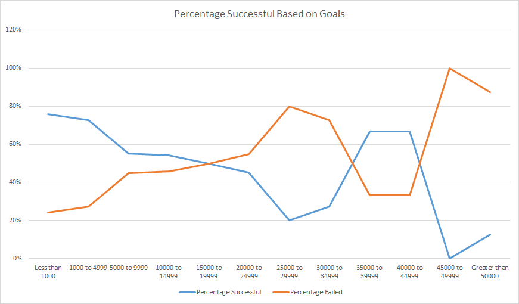

# Kickstarting with Excel 

This project is based on mastering Microsoft Excel and most of its important formulas and functions along with understanding the data and reviewing it to help Louise a playwright secure success.

## Overview of Project

Louise is an upcoming playwright and has requested help to be more confident with her decision to raise $10,000 for a play through crowd funding on kickstarter.
This project will target the particular arts market in regards to gain more insight to making a better decision. The project also analyzes data to clients interests and expereience with raising funds to proceed and implement her passion on a play written called "Fever". 
My Job would be to understand the trends within the region and propose my findings. 

### Purpose

To help the client solidify her decision and set her expectations based on information available to her for a successful project campaign. As well as broaden her horizons by understanding the various catagories/ country she wishes to pursue in the future.

## Analysis and Challenges

### Analysis:
At first glance of the crowd funding data from kickstarter I can understand there are many catagories where fundraising were requested for. Narrowing it down to Louise's catagory of requests it becomes clear that around the globe, US and Great Britain dominates the market where crowd funding in theater was seen to be the most. A quick glance shows,
  * _US market kickstarter_ - A total of **3038 kickstarters** - Out of which the majority being theater 525 successful campaigns - second catagory being music
  * _GB market Kickstarter_ - A total of **604 kickstarters** - out of which the majority being theater with 258 successful campaings -  the second catagory being technology 
  * Global kickstarter campaings where theater has the highest number of crowd funding.

Moving deeper into the data I find that plays being the most requested crowd funding kickstarter in the US so Louise will be happy to know that her potential for starting a crowd fundraiser is positve. In regards to a favorable campaign for success, looking at trends for past kickstarters launch timeline for raising funds were greatly favorable to reach their goal  during late spring and early summer *May, June & july*.

Now when playing with numbers to support my backing, it certainly highlights that Louise's goal for her crowd funder is on the higher side of the spectrum. Considering that the median goal for a successful theater production is just about *$3000* and When comparing campaigns that failed to acheive their goal, the median was about *$5000*. To further solidify my research , the Edinburgh Fringe Film Festival research, Play titles which sparked a unique interest to the client Louise helped back up my standing for a reduce with the fundraiser goal Within *($2000 - $4000)* with pledge averaging *($30-$40)*.

### Challenges
  * Putting myself in a new domain (fundraising, plays, types of plays)
  * It would have been helpful to even narrow down the analysis by adding the genre. 

### Analysis of Outcomes Based on Launch Date

There is a trend noticed with past successful campaigns (Theater Catagory) that were initiated in April with a steep increase in May and gradually decreasing in the months to follow June, July and August. The rising number during May shows a promising time to go live with her fund raising campaign. I have noticed a stagering 441 campaigns that faired successful during these months *(April-August)*of the total 693 kickstarters which is alomsot a 65% success rate when compared to other months during the year. Noting it to be more likely successful to campaigns during the holidays are less successful (meaning family time, summer holdidays and Chtistmas)

#### Image showing Outcomes with respect to Kickstarter Launch Dates

### Analysis of Outcomes Based on Goals

I noticed that the Client's fundraising goal proposal when analyzing the data from past kickstarters for theater productions depicts a risk of failing to secure the goal has a 50% chance to succeed. A more reasonable goal to have and attract a possible larger number of crowd to fund or pledge would be something the client has to reevaluate. In my analysis, I noticed that to acheive desired goal fund, a goal ranging within and close to the *50th percentile* *$3000-4000* would be an goal inclined to succeed.     

#### Image showing Outcomes with respect to their Goals.

### Challenges and Difficulties Encountered

* I did fall to a basic mistake of not reading the deliverable or requirements, this made me rush through the entire course once again to actually debugg or review my answers. 

## Results

- What are two conclusions you can draw about the Outcomes based on Launch Date?
  A- A spike in the trend line shows that many kickstarters begun their fund raising campaign during the spring time. 
  B- Large number of successful campaigns lasted through the summer.

- What can you conclude about the Outcomes based on Goals?
  A - A successful fundraising goal can be acheived when looking and comparing at past data is within a range of *($1000 - $5000)*
   
- What are some limitations of this dataset?
  A - I feel that further analyzind the data with respect to the genre of the play would give me more insight to further solidify a decision.

- What are some other possible tables and/or graphs that we could create?
  A - Table that includes or analyzes genres of plays 
  B - A diagram showing the standard deviation of the outcomes vs goals, puts it into a better perspective to see the median and mean of goals for plays 